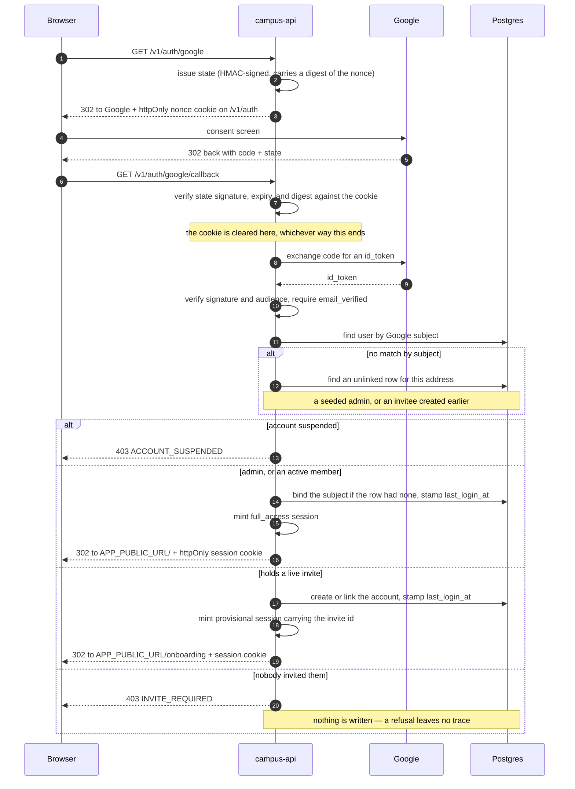
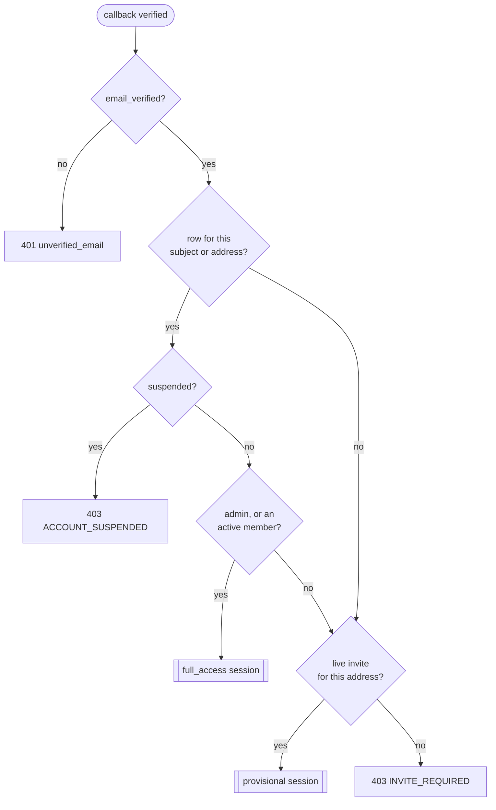
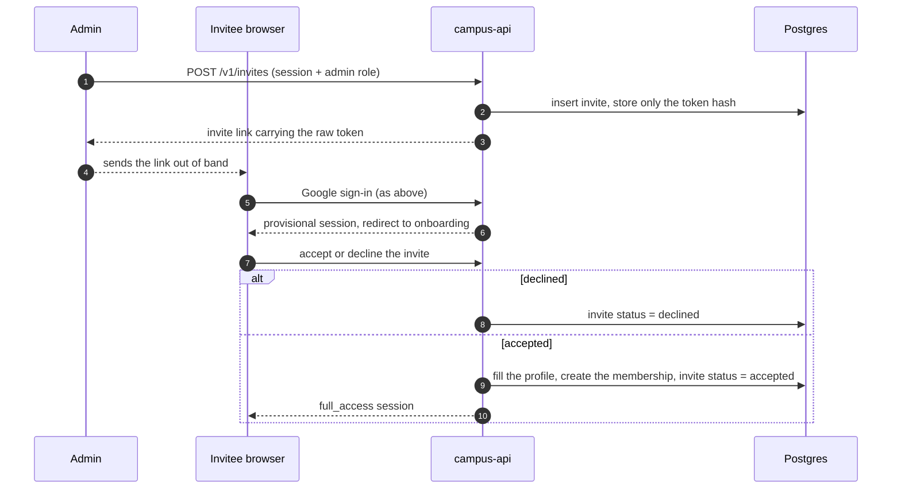
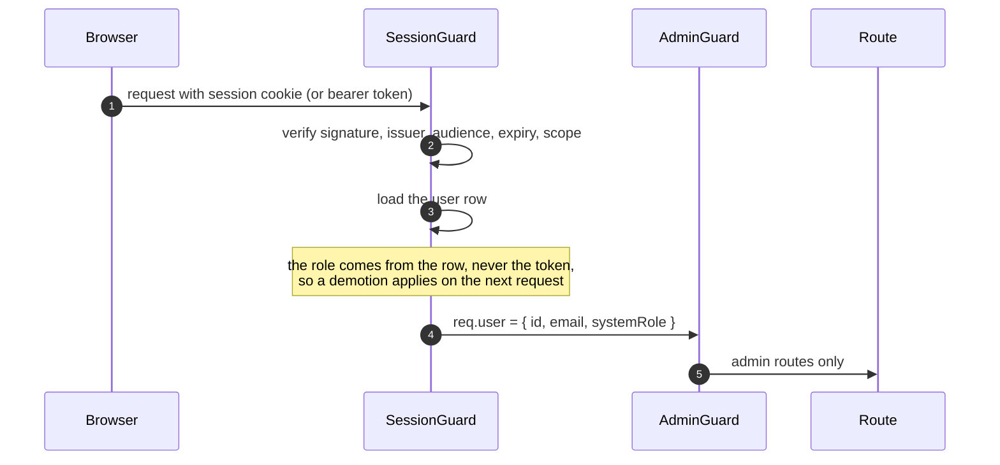

# Authentication

Google is the only way in. There is no password, no self-service signup, and
no account created for anyone who has not been invited — so "login" and
"signup" are the same route, and differ only in what the callback finds.

## The two outcomes

A completed Google sign-in ends in one of two sessions:

| Session | Who gets it | What it opens |
| --- | --- | --- |
| `full_access` | Already on the roster: an admin, or an active cohort member | The campus |
| `provisional` | Holds an invite they have not accepted yet | Onboarding, and nothing else |

Everyone else is turned away, and no account is created for them.

## Sign-in

## Which branch a caller takes

"Active member" means a membership that has not ended, and — for students —
one carrying an explicit `active` status. An unfinished enrolment is not a
way in.

## Signup, end to end

Signup is the provisional branch plus onboarding. The accept step is a
separate ticket; the shape it plugs into is fixed:

## Authenticated requests afterwards

## What protects what

- **State**: signed with `AUTH_STATE_SECRET` and matched against an httpOnly
  cookie, so a callback has to have come from a browser that started here.
  The state carries a digest of the nonce, never the nonce, because the state
  lands in this API's own request log.
- **Identity**: the Google subject, not the address. An address already bound
  to another subject is never re-bound, so a reissued Workspace address cannot
  inherit the previous holder's account.
- **`email_verified`**: required, because an invite was sent to a mailbox and
  an unverified address only proves control of a Google account.
- **Session**: signed with `AUTH_SESSION_SECRET`, in an httpOnly cookie, so
  script on the page can never read it. Rotating that secret signs everybody
  out.
- **Scope**: a provisional session cannot reach an ordinary route, so being
  half-onboarded is not a licence to use the campus.

## Not built yet

- **Refresh tokens.** A session expires and sign-in repeats — cheap, because
  Google keeps the account selected.
- **Accept and decline.** The provisional session and the invite id it carries
  are what those routes will read.
