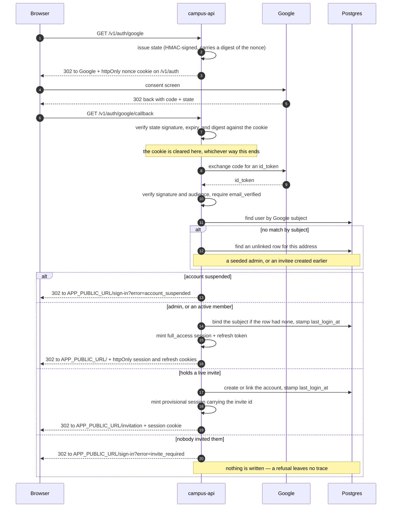
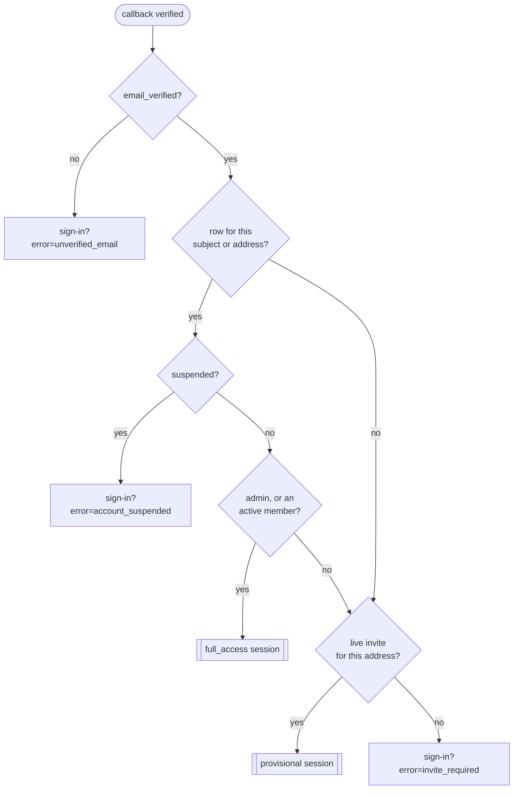
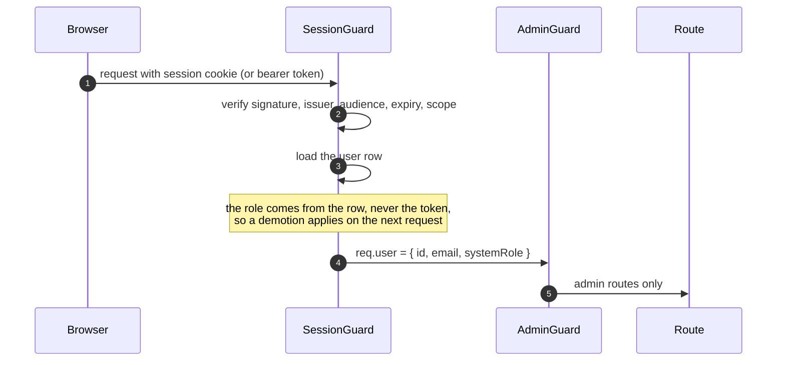
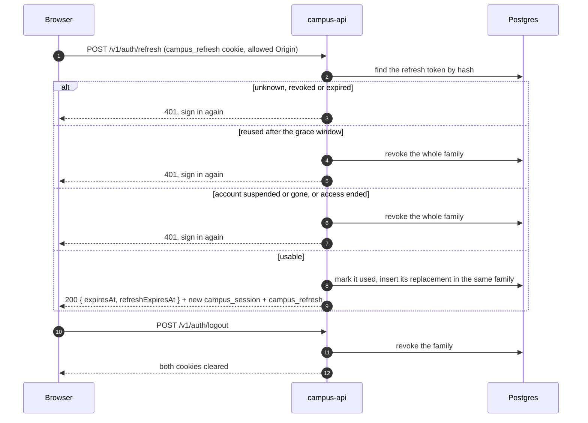
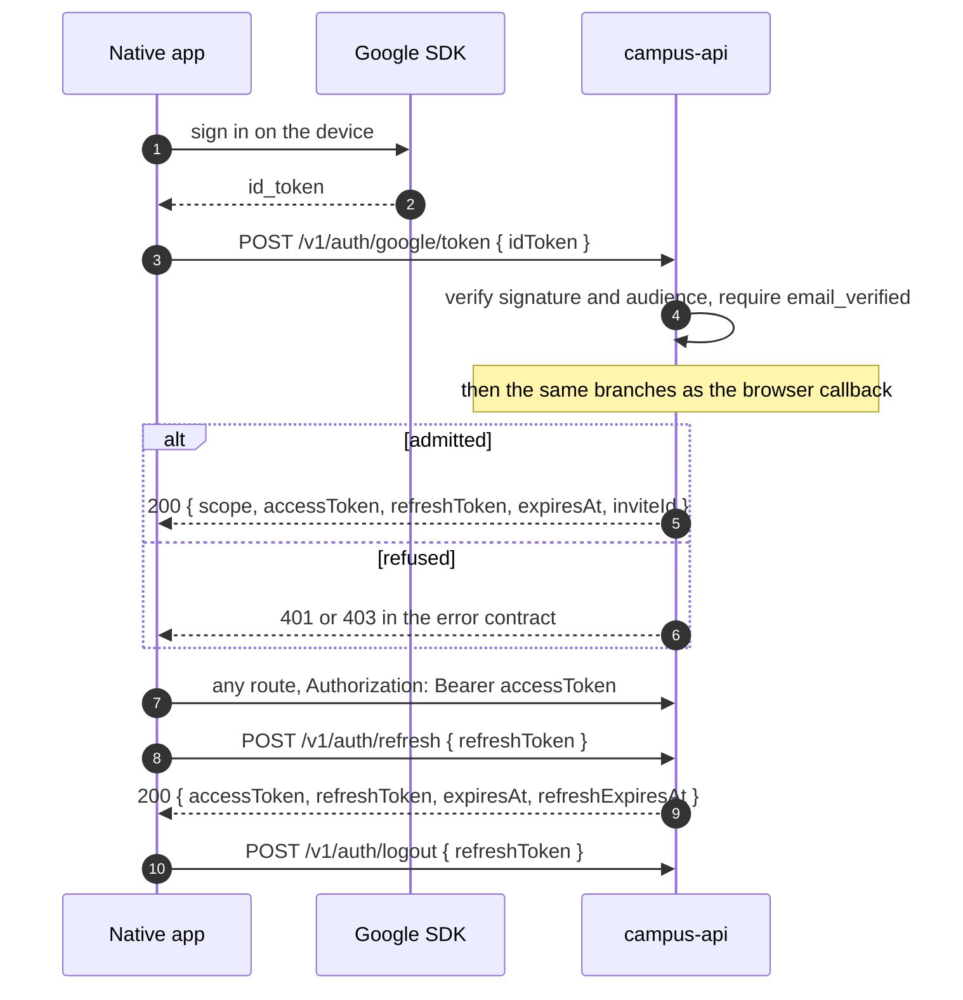

# Authentication

Google is the only way in. There is no password, no self-service signup, and
no account created for anyone who has not been invited — so "login" and
"signup" are the same route, and differ only in what the callback finds.

## The two outcomes

A completed Google sign-in ends in one of two sessions:

| Session       | Who gets it                                                 | What it opens                |
| ------------- | ----------------------------------------------------------- | ---------------------------- |
| `full_access` | Already on the roster: an admin, or an active cohort member | The campus                   |
| `provisional` | Holds an invite they have not accepted yet                  | Onboarding, and nothing else |

Everyone else is turned away, and no account is created for them.

Every ending of a sign-in, refusals included, is a redirect back into the web
app (`APP_PUBLIC_URL`). The callback is a top-level navigation, so a JSON
error would leave the user looking at raw JSON on the API's own domain.

## Sign-in

```mermaid
sequenceDiagram
    autonumber
    participant B as Browser
    participant A as campus-api
    participant G as Google
    participant DB as Postgres

    B->>A: GET /v1/auth/google
    A->>A: issue state (HMAC-signed, carries a digest of the nonce)
    A-->>B: 302 to Google + httpOnly nonce cookie on /v1/auth
    B->>G: consent screen
    G-->>B: 302 back with code + state
    B->>A: GET /v1/auth/google/callback

    A->>A: verify state signature, expiry, and digest against the cookie
    Note over A: the cookie is cleared here, whichever way this ends
    A->>G: exchange code for an id_token
    G-->>A: id_token
    A->>A: verify signature and audience, require email_verified

    A->>DB: find user by Google subject
    alt no match by subject
        A->>DB: find an unlinked row for this address
        Note over A,DB: a seeded admin, or an invitee created earlier
    end

    alt account suspended
        A-->>B: 302 to APP_PUBLIC_URL/sign-in?error=account_suspended
    else admin, or an active member
        A->>DB: bind the subject if the row had none, stamp last_login_at
        A->>A: mint full_access session + refresh token
        A-->>B: 302 to APP_PUBLIC_URL/ + httpOnly session and refresh cookies
    else holds a live invite
        A->>DB: create or link the account, stamp last_login_at
        A->>A: mint provisional session carrying the invite id
        A-->>B: 302 to APP_PUBLIC_URL/invitation + session cookie
    else nobody invited them
        A-->>B: 302 to APP_PUBLIC_URL/sign-in?error=invite_required
        Note over A,DB: nothing is written — a refusal leaves no trace
    end
```

## Which branch a caller takes

```mermaid
flowchart TD
    start([callback verified]) --> verified{email_verified?}
    verified -- no --> refuse401[sign-in?error=unverified_email]
    verified -- yes --> known{row for this<br/>subject or address?}

    known -- yes --> suspended{suspended?}
    suspended -- yes --> refuse403a[sign-in?error=account_suspended]
    suspended -- no --> roster{admin, or an<br/>active member?}
    roster -- yes --> full[[full_access session]]
    roster -- no --> invite

    known -- no --> invite{live invite<br/>for this address?}
    invite -- yes --> prov[[provisional session]]
    invite -- no --> refuse403b[sign-in?error=invite_required]
```

A failure earlier than that — a cancel at Google, a state that does not match
the browser's cookie, an expired sign-in — ends the same way, with its own
code. The full list of codes is in the API guide
(`apps/campus-api/docs/intro.md`). A deployment with Google sign-in switched
off is the one exception: both routes answer 404, as though absent.

"Active member" means a membership that has not ended, and — for students —
one carrying an explicit `active` status. An unfinished enrolment is not a
way in.

A guest is an active member like any other, with one difference: their
membership carries `access_expires_at`, and once that passes they stop
counting here and are turned away at the next sign-in. Guests are invited to
one cohort and see only that cohort.

## Signup, end to end

Signup is the provisional branch plus onboarding, ending at the accept that
turns a provisional session into a full-access one:

```mermaid
sequenceDiagram
    autonumber
    participant Admin
    participant B as Invitee browser
    participant A as campus-api
    participant DB as Postgres

    Admin->>A: POST /v1/invites (session + admin role)
    A->>DB: insert invite, store only the token hash
    A-->>Admin: invite link carrying the raw token

    A-->>B: emails the link (Resend); the admin can also share it
    B->>A: POST /v1/invites/preview { token } — no session
    A-->>B: the offer: cohort, track, role, invited by, address
    B->>A: Google sign-in (as above)
    A-->>B: provisional session, redirect to onboarding

    B->>A: accept or decline the invite
    alt declined
        A->>DB: invite status = declined
    else accepted
        A->>DB: fill the profile, create the membership, invite status = accepted
        A-->>B: full_access session + refresh cookie
    end
```

## Authenticated requests afterwards

```mermaid
sequenceDiagram
    autonumber
    participant B as Browser
    participant G as SessionGuard
    participant R as AdminGuard
    participant H as Route

    B->>G: request with session cookie (or bearer token)
    G->>G: verify signature, issuer, audience, expiry, scope
    G->>G: load the user row
    Note over G: the role comes from the row, never the token,<br/>so a demotion applies on the next request
    G->>R: req.user = { id, email, systemRole }
    R->>H: admin routes only
```

## Who is signed in

The cookies are httpOnly, so the web app cannot look at them. It asks
instead: `GET /v1/auth/me` accepts either kind of session and answers with its
`scope`, its expiry, the account, and — for full access — the cohort place
that admits it. A provisional answer carries the `inviteId` still to be
answered. The account and membership are read from the database, like
everything else behind the guard.

## What protects what

- **State**: signed with `AUTH_STATE_SECRET` and matched against an httpOnly
  cookie, so a callback has to have come from a browser that started here.
  The state carries a digest of the nonce, never the nonce, because the state
  lands in this API's own request log.
- **Identity**: the Google subject, not the address. An address already bound
  to another subject is never re-bound, so a reissued Workspace address cannot
  inherit the previous holder's account.
- **`email_verified`**: required, because an invite was sent to a mailbox and
  an unverified address only proves control of a Google account.
- **Session**: signed with `AUTH_SESSION_SECRET`, in an httpOnly cookie, so
  script on the page can never read it. Rotating that secret invalidates every
  access token; refresh tokens survive it, so browsers recover on their next
  refresh.
- **Refresh token**: random, stored only as a SHA-256 hash, in an httpOnly
  cookie scoped to `/v1/auth`. Refresh and logout refuse an `Origin` outside
  `CORS_ORIGINS`, and so does any cookie-authenticated unsafe method elsewhere,
  because a cross-site cookie has to be `SameSite=None`.
- **Scope**: a provisional session cannot reach an ordinary route, so being
  half-onboarded is not a licence to use the campus.
- **Lifetime**: an access token lasts `AUTH_SESSION_TTL_MINUTES` (15, and
  never more: `@campus/session`'s session policy caps it, because `world`
  depends on it), or sooner when every live membership has an
  `access_expires_at` — then the last of those to end. A token cannot
  outlive the access it stands for, which is what keeps a guest's visit from
  running on until the token happens to lapse.
- **Refresh**: see below. Every refresh re-checks the account and its access,
  so fifteen minutes is the longest a person whose access ran out on its own
  can keep using a token they already hold.
- **Session epoch**: every token carries the account's `session_epoch` as it
  was when the token was signed (the `epoch` claim), and campus-api and
  `world` both refuse a token whose epoch is not the one on the row. Ending
  an account's sessions on purpose bumps the column, so it takes effect on
  the next request rather than when the token lapses. See
  [Ending an account's sessions](#ending-an-accounts-sessions).

## Refreshing and signing out

A full-access sign-in sets two cookies:

| Cookie           | Holds            | Sent to         | Lives                                   |
| ---------------- | ---------------- | --------------- | --------------------------------------- |
| `campus_session` | the access token | every route     | 15 minutes (`AUTH_SESSION_TTL_MINUTES`) |
| `campus_refresh` | a refresh token  | `/v1/auth` only | 30 days (`AUTH_REFRESH_TTL_DAYS`)       |

A provisional session gets the first only: onboarding is short, and repeating
sign-in is cheap.

```mermaid
sequenceDiagram
    autonumber
    participant B as Browser
    participant A as campus-api
    participant DB as Postgres

    B->>A: POST /v1/auth/refresh (campus_refresh cookie, allowed Origin)
    A->>DB: find the refresh token by hash
    alt unknown, revoked or expired
        A-->>B: 401, sign in again
    else reused after the grace window
        A->>DB: revoke the whole family
        A-->>B: 401, sign in again
    else account suspended or gone, or access ended
        A->>DB: revoke the whole family
        A-->>B: 401, sign in again
    else usable
        A->>DB: mark it used, insert its replacement in the same family
        A-->>B: 200 { expiresAt, refreshExpiresAt } + new campus_session + campus_refresh
    end

    B->>A: POST /v1/auth/logout
    A->>DB: revoke the family
    A-->>B: both cookies cleared
```

- **A family** is one sign-in and every token rotated from it. Revoking one
  token revokes the family, so a stolen refresh token dies with its owner's
  sign-out.
- **Rotation, with a grace window.** Each refresh token works once. A second
  use within 60 seconds is accepted — two tabs refreshing at the same moment
  is not theft — and a use after that revokes the family.
- **Refreshes and revocations of one family take turns.** Each locks the
  family's rows first. A refresh mints its replacement under that lock, and a
  revocation — reuse detected, sign-out, suspension, access ended — waits
  for it and then revokes the replacement too. Without the lock, a sign-out
  landing mid-refresh could leave the new token alive.
- **Refresh before the access token runs out**, not only after a 401. The
  refresh answers `{ expiresAt, refreshExpiresAt }` and `GET /v1/auth/me`
  carries `expiresAt`, so schedule each refresh from the real deadline — a
  guest's visit can bring it forward — rather than assuming fifteen minutes.
  `world` depends on it: see below.
- **Retention.** A used token is deleted 30 minutes after use and an expired
  one 3 days after expiry, during refreshes.
- **Every access token names its family** (the `sid` claim).
- **Shared with `world`, and only the access cookie.** With
  `AUTH_COOKIE_DOMAIN` set, `campus_session` is also sent to sibling
  subdomains, which is how `world` on its own host receives it.
  `campus_refresh` stays on campus-api's host and path alone.

## Ending an account's sessions

Signing out ends one sign-in. Taking somebody's access away has to end all
of them, at once, and without waiting for a token to run out. That is
`SessionIssuer.revokeAllSessions(userId)`, and it does two things in one
transaction:

- **Bumps `users.session_epoch`.** Every access token already out was signed
  with the old value, so the guard answers 401 `Session has been revoked` on
  its next request, and `world` refuses it on an upgrade.
- **Revokes every refresh family the account holds**, under the same lock a
  refresh takes. Without this the dead access token could be swapped for a
  new one on the new epoch.

The claim is required. A token with no `epoch` is refused outright, since it
cannot be told apart from one that a revocation was meant to end.

The epoch only goes up, and it is compared for equality. An account whose
sessions were revoked can sign in again, on the new epoch, if whatever took
the access away still lets it through the sign-in gate.

It is for access being taken away, not for an ending the person chose:
signing out and declining an invite do not touch it.

Nothing calls it yet. Suspending an account, removing a member and cutting a
visit short are the routes that will, each passing the transaction of its
own change so the two commit together.

## Native apps

A native app cannot use the redirect flow: it has no cookie jar the API can
rely on, and no page for the callback to land on. It gets the same sessions
by a different road, and the same rules decide who gets one.

```mermaid
sequenceDiagram
    autonumber
    participant M as Native app
    participant G as Google SDK
    participant A as campus-api

    M->>G: sign in on the device
    G-->>M: id_token
    M->>A: POST /v1/auth/google/token { idToken }
    A->>A: verify signature and audience, require email_verified
    Note over A: then the same branches as the browser callback
    alt admitted
        A-->>M: 200 { scope, accessToken, refreshToken, expiresAt, inviteId }
    else refused
        A-->>M: 401 or 403 in the error contract
    end

    M->>A: any route, Authorization: Bearer accessToken
    M->>A: POST /v1/auth/refresh { refreshToken }
    A-->>M: 200 { accessToken, refreshToken, expiresAt, refreshExpiresAt }
    M->>A: POST /v1/auth/logout { refreshToken }
```

- **Audience.** The id_token must be addressed to `GOOGLE_CLIENT_ID` or to a
  client listed in `GOOGLE_MOBILE_CLIENT_IDS`. That is the whole of the check
  that the token was minted for this campus and not for another app the user
  signs in to with Google, so only this project's own clients belong there.
- **No state, no nonce cookie.** Those protect a redirect from being forged
  or replayed into a browser. There is no redirect here: the app hands over
  a token Google signed for it directly.
- **Tokens in the body, only for a caller with no cookie.** Refresh answers
  in the body only when the refresh token arrived in the body and no refresh
  cookie did; the invite decision only when the session arrived as a bearer
  token. A browser is always answered in httpOnly cookies, so a page cannot
  ask to be handed tokens its script could read.
- **Everything else is shared.** One family per sign-in, rotation with the
  grace window, the access cap, and the per-refresh re-check are the same
  code. `world` already takes a bearer token on an upgrade that carries no
  `Origin`.

### How `world` follows a sign-in

A socket lasts for hours; an access token for fifteen minutes, and the
browser swaps it through campus-api, which an open socket never sees. So
`world` does not close a socket when its access token expires. It follows the
sign-in named by `sid`: the socket stays while that family has a token that is
not revoked, not expired, and was minted within
`WORLD_SESSION_REFRESH_WINDOW_SECONDS` (20 minutes). Every refresh re-checks
the account and its access before minting, so a recent token is campus-api
vouching for the session again.

| What happened              | When the socket closes                                              |
| -------------------------- | ------------------------------------------------------------------- |
| Signed out                 | Within a heartbeat (30 s)                                           |
| Suspended                  | Within a heartbeat — `world` checks the account itself              |
| Sessions revoked           | Within a heartbeat — `world` compares the socket's epoch to the row |
| Visit ran out (a guest)    | Within a heartbeat — `world` re-checks the cohort membership        |
| Access ran out on its own  | When a refresh fails, or at most the window after the last good one |
| Browser stopped refreshing | The window after the last refresh                                   |

A token with no `sid` — minted before this existed — is followed the old way,
by its own expiry.

## Not built yet

- **The routes that take access away.** The mechanism for ending an
  account's sessions at once is built (see
  [Ending an account's sessions](#ending-an-accounts-sessions)), but nothing
  calls it: there is no route yet to suspend an account, remove a member or
  cut a visit short.
