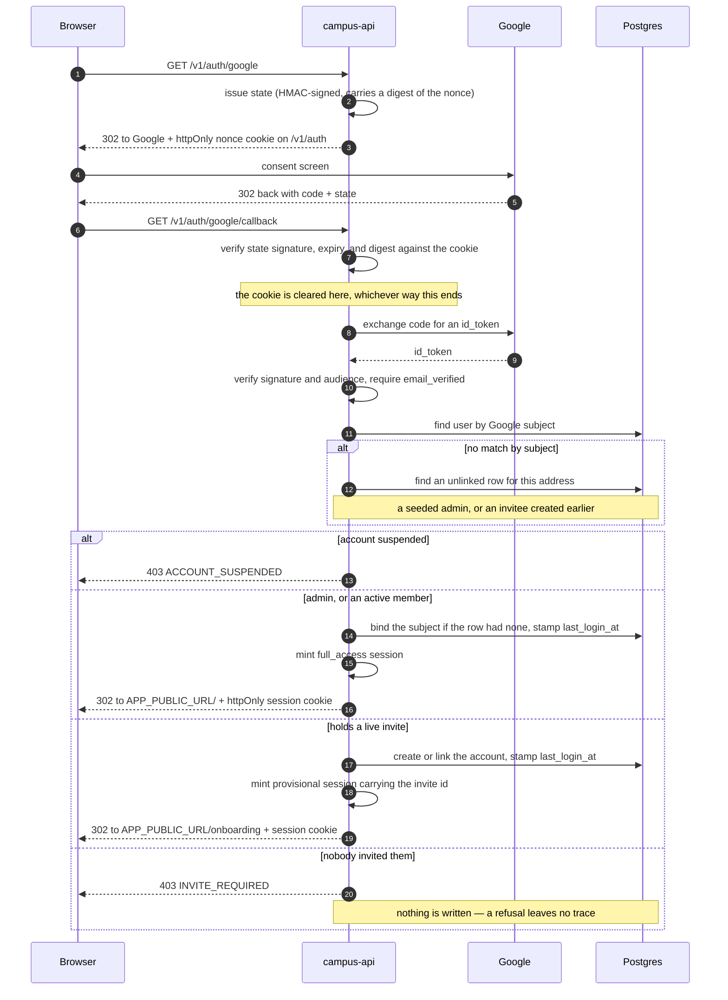
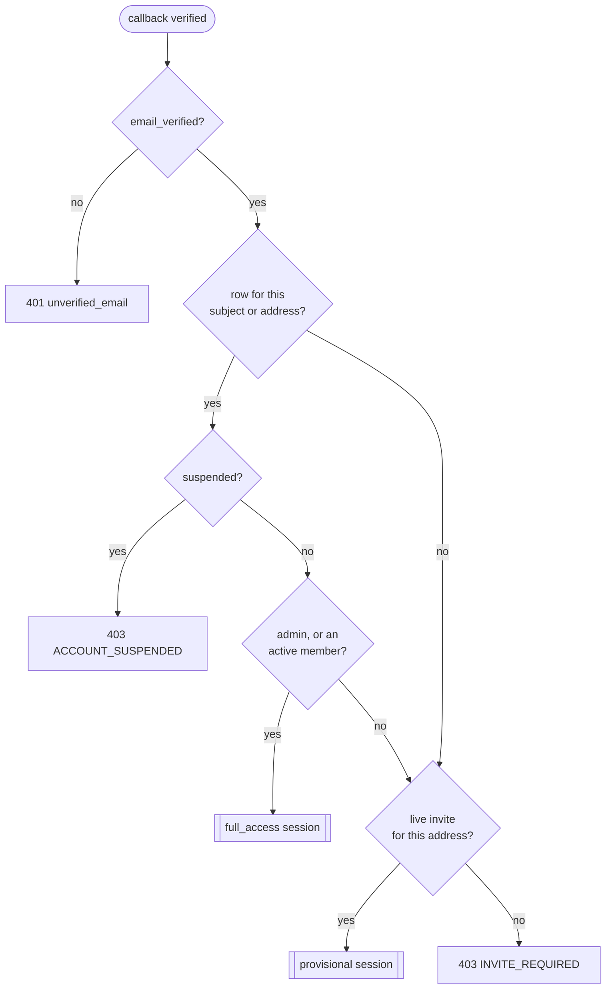
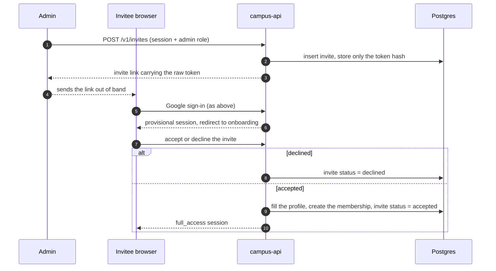
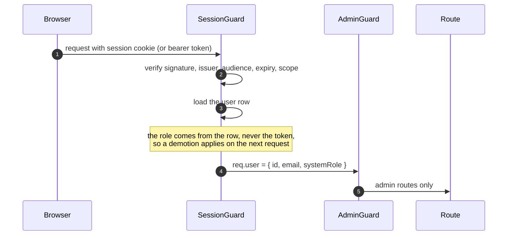
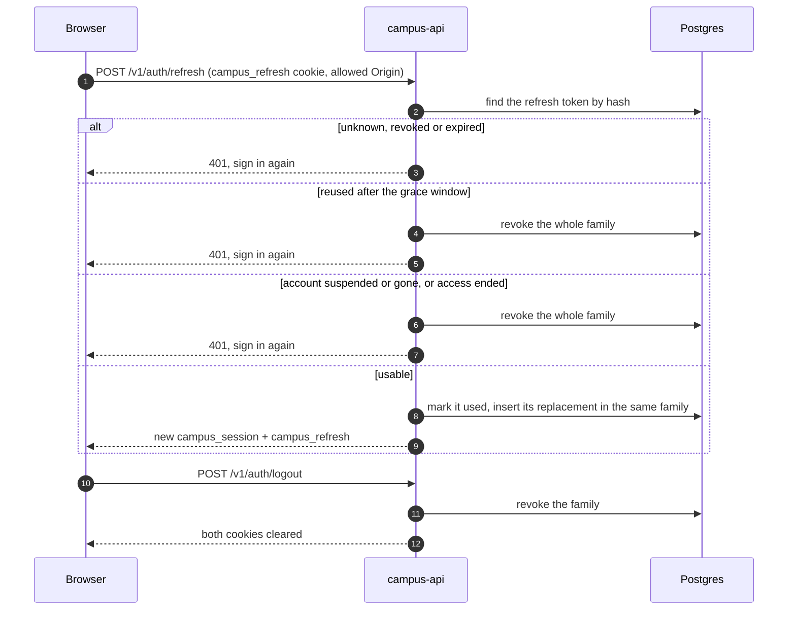

# Authentication

Google is the only way in. There is no password, no self-service signup, and
no account created for anyone who has not been invited — so "login" and
"signup" are the same route, and differ only in what the callback finds.

## The two outcomes

A completed Google sign-in ends in one of two sessions:

| Session | Who gets it | What it opens |
| --- | --- | --- |
| `full_access` | Already on the roster: an admin, or an active cohort member | The campus |
| `provisional` | Holds an invite they have not accepted yet | Onboarding, and nothing else |

Everyone else is turned away, and no account is created for them.

## Sign-in

```mermaid
sequenceDiagram
    autonumber
    participant B as Browser
    participant A as campus-api
    participant G as Google
    participant DB as Postgres

    B->>A: GET /v1/auth/google
    A->>A: issue state (HMAC-signed, carries a digest of the nonce)
    A-->>B: 302 to Google + httpOnly nonce cookie on /v1/auth
    B->>G: consent screen
    G-->>B: 302 back with code + state
    B->>A: GET /v1/auth/google/callback

    A->>A: verify state signature, expiry, and digest against the cookie
    Note over A: the cookie is cleared here, whichever way this ends
    A->>G: exchange code for an id_token
    G-->>A: id_token
    A->>A: verify signature and audience, require email_verified

    A->>DB: find user by Google subject
    alt no match by subject
        A->>DB: find an unlinked row for this address
        Note over A,DB: a seeded admin, or an invitee created earlier
    end

    alt account suspended
        A-->>B: 403 ACCOUNT_SUSPENDED
    else admin, or an active member
        A->>DB: bind the subject if the row had none, stamp last_login_at
        A->>A: mint full_access session
        A-->>B: 302 to APP_PUBLIC_URL/ + httpOnly session cookie
    else holds a live invite
        A->>DB: create or link the account, stamp last_login_at
        A->>A: mint provisional session carrying the invite id
        A-->>B: 302 to APP_PUBLIC_URL/onboarding + session cookie
    else nobody invited them
        A-->>B: 403 INVITE_REQUIRED
        Note over A,DB: nothing is written — a refusal leaves no trace
    end
```

## Which branch a caller takes

```mermaid
flowchart TD
    start([callback verified]) --> verified{email_verified?}
    verified -- no --> refuse401[401 unverified_email]
    verified -- yes --> known{row for this<br/>subject or address?}

    known -- yes --> suspended{suspended?}
    suspended -- yes --> refuse403a[403 ACCOUNT_SUSPENDED]
    suspended -- no --> roster{admin, or an<br/>active member?}
    roster -- yes --> full[[full_access session]]
    roster -- no --> invite

    known -- no --> invite{live invite<br/>for this address?}
    invite -- yes --> prov[[provisional session]]
    invite -- no --> refuse403b[403 INVITE_REQUIRED]
```

"Active member" means a membership that has not ended, and — for students —
one carrying an explicit `active` status. An unfinished enrolment is not a
way in.

A guest is an active member like any other, with one difference: their
membership carries `access_expires_at`, and once that passes they stop
counting here and are turned away at the next sign-in. Guests are invited to
one cohort and see only that cohort.

## Signup, end to end

Signup is the provisional branch plus onboarding, ending at the accept that
turns a provisional session into a full-access one:

```mermaid
sequenceDiagram
    autonumber
    participant Admin
    participant B as Invitee browser
    participant A as campus-api
    participant DB as Postgres

    Admin->>A: POST /v1/invites (session + admin role)
    A->>DB: insert invite, store only the token hash
    A-->>Admin: invite link carrying the raw token

    Admin-->>B: sends the link out of band
    B->>A: Google sign-in (as above)
    A-->>B: provisional session, redirect to onboarding

    B->>A: accept or decline the invite
    alt declined
        A->>DB: invite status = declined
    else accepted
        A->>DB: fill the profile, create the membership, invite status = accepted
        A-->>B: full_access session
    end
```

## Authenticated requests afterwards

```mermaid
sequenceDiagram
    autonumber
    participant B as Browser
    participant G as SessionGuard
    participant R as AdminGuard
    participant H as Route

    B->>G: request with session cookie (or bearer token)
    G->>G: verify signature, issuer, audience, expiry, scope
    G->>G: load the user row
    Note over G: the role comes from the row, never the token,<br/>so a demotion applies on the next request
    G->>R: req.user = { id, email, systemRole }
    R->>H: admin routes only
```

## What protects what

- **State**: signed with `AUTH_STATE_SECRET` and matched against an httpOnly
  cookie, so a callback has to have come from a browser that started here.
  The state carries a digest of the nonce, never the nonce, because the state
  lands in this API's own request log.
- **Identity**: the Google subject, not the address. An address already bound
  to another subject is never re-bound, so a reissued Workspace address cannot
  inherit the previous holder's account.
- **`email_verified`**: required, because an invite was sent to a mailbox and
  an unverified address only proves control of a Google account.
- **Session**: signed with `AUTH_SESSION_SECRET`, in an httpOnly cookie, so
  script on the page can never read it. Rotating that secret signs everybody
  out.
- **Scope**: a provisional session cannot reach an ordinary route, so being
  half-onboarded is not a licence to use the campus.
- **Lifetime**: an access token lasts `AUTH_SESSION_TTL_MINUTES` (15, and
  never more: `@campus/session`'s session policy caps it, because `world`
  depends on it), or
  until the soonest `access_expires_at` among the holder's memberships if that
  comes first. A token cannot outlive the access it stands for, which is what
  keeps a guest's visit from running on until the token happens to lapse.
- **Refresh**: see below. Every refresh re-checks the account and its access,
  so fifteen minutes is also how long a removed or suspended person can keep
  using a token they already hold.

## Refreshing and signing out

A full-access sign-in sets two cookies:

| Cookie | Holds | Sent to | Lives |
| --- | --- | --- | --- |
| `campus_session` | the access token | every route | 15 minutes (`AUTH_SESSION_TTL_MINUTES`) |
| `campus_refresh` | a refresh token | `/v1/auth` only | 30 days (`AUTH_REFRESH_TTL_DAYS`) |

A provisional session gets the first only: onboarding is short, and repeating
sign-in is cheap.

```mermaid
sequenceDiagram
    autonumber
    participant B as Browser
    participant A as campus-api
    participant DB as Postgres

    B->>A: POST /v1/auth/refresh (campus_refresh cookie, allowed Origin)
    A->>DB: find the refresh token by hash
    alt unknown, revoked or expired
        A-->>B: 401, sign in again
    else reused after the grace window
        A->>DB: revoke the whole family
        A-->>B: 401, sign in again
    else account suspended or gone, or access ended
        A->>DB: revoke the whole family
        A-->>B: 401, sign in again
    else usable
        A->>DB: mark it used, insert its replacement in the same family
        A-->>B: new campus_session + campus_refresh
    end

    B->>A: POST /v1/auth/logout
    A->>DB: revoke the family
    A-->>B: both cookies cleared
```

- **A family** is one sign-in and every token rotated from it. Revoking one
  token revokes the family, so a stolen refresh token dies with its owner's
  sign-out.
- **Rotation, with a grace window.** Each refresh token works once. A second
  use within 60 seconds is accepted — two tabs refreshing at the same moment
  is not theft — and a use after that revokes the family.
- **Refresh before the access token runs out**, on a timer, not only after a
  401. `world` depends on it: see below.
- **Retention.** A used token is deleted 30 minutes after use and an expired
  one 3 days after expiry, during refreshes.
- **Every access token names its family** (the `sid` claim).

### How `world` follows a sign-in

A socket lasts for hours; an access token for fifteen minutes, and the
browser swaps it through campus-api, which an open socket never sees. So
`world` does not close a socket when its access token expires. It follows the
sign-in named by `sid`: the socket stays while that family has a token that is
not revoked, not expired, and was minted within
`WORLD_SESSION_REFRESH_WINDOW_SECONDS` (20 minutes). Every refresh re-checks
the account and its access before minting, so a recent token is campus-api
vouching for the session again.

| What happened | When the socket closes |
| --- | --- |
| Signed out | Within a heartbeat (30 s) |
| Suspended | Within a heartbeat — `world` checks the account itself |
| Access ended, or removed from the cohort | When a refresh fails, or at most the window after the last good one |
| Browser stopped refreshing | The window after the last refresh |

A token with no `sid` — minted before this existed — is followed the old way,
by its own expiry.

## Not built yet

- **Immediate revocation.** Access taken away early — removing a member,
  cutting a visit short — takes effect when the next refresh fails, so within
  fifteen minutes for campus-api and within the refresh window for `world`.
  Nothing yet revokes a family the moment access is taken away.
