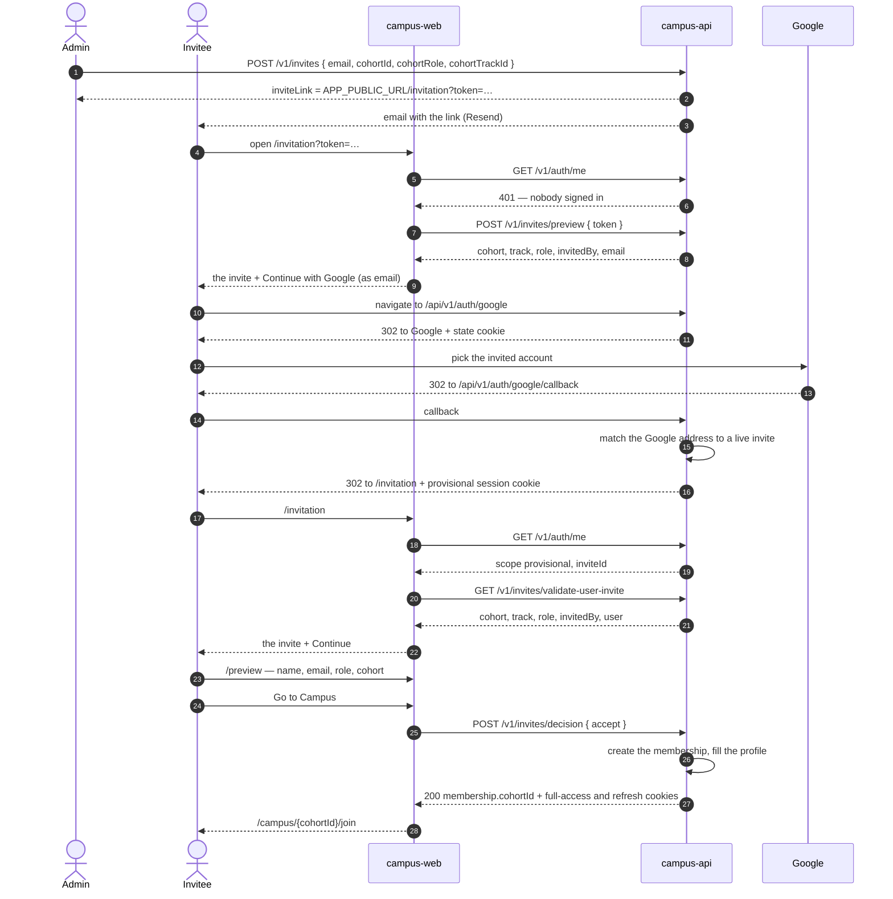

# From invite to campus

What happens from the moment someone is invited to the moment they are
standing in their cohort's campus: each screen in campus-web, and each call
it makes to campus-api. Browser calls go through campus-web's proxy, so
`/api/v1/...` in the browser is `/v1/...` on campus-api — see
[deployment.md](./deployment.md#domains-and-cookies).

The mechanics behind each step (state, sessions, refresh) are in
[auth-flow.md](./auth-flow.md). This page is the journey.

## At a glance

| #   | Where                     | What the invitee sees                                                          | Call                                                                                 |
| --- | ------------------------- | ------------------------------------------------------------------------------ | ------------------------------------------------------------------------------------ |
| 1   | Admin                     | —                                                                              | `POST /v1/invites` returns `inviteLink`                                              |
| 2   | Inbox                     | An email from campus-api with the link (Resend, when `FF_EMAIL_ENABLED` is on) | —                                                                                    |
| 3   | `/invitation?token=…`     | The invite: cohort, track, role, who invited them, Continue with Google        | `GET /api/v1/auth/me` → 401, then `POST /api/v1/invites/preview`                     |
| 4   | Google                    | Account picker                                                                 | top-level navigation to `/api/v1/auth/google`                                        |
| 5   | `/invitation`             | Back from Google, signed in                                                    | `GET /api/v1/auth/me` → provisional, then `GET /api/v1/invites/validate-user-invite` |
| 6   | `/preview`                | "Are your details correct?"                                                    | none — reuses step 5's answer                                                        |
| 7   | Go to Campus              | —                                                                              | `POST /api/v1/invites/decision` `{ "decision": "accept" }`                           |
| 8   | `/campus/{cohortId}/join` | Their cohort's campus                                                          | `GET /api/v1/auth/me` → full access                                                  |

## The whole journey



## Screen by screen

### 1–2. The invite and the email

An admin creates the invite with `POST /v1/invites`. The response carries
`inviteLink` — `APP_PUBLIC_URL/invitation?token=<raw>` — exactly once; only
its hash is stored. The invite stays open for `INVITE_TTL_DAYS` (7) unless
the admin sets `expiresAt`.

campus-api then emails the link to the invitee through Resend: who invited
them, to which cohort and role, the address to sign in with, and when the
invite expires (and, for a guest, when the visit ends). The response's
`emailStatus` says how it went:

| `emailStatus` | Meaning                                                             | The admin should           |
| ------------- | ------------------------------------------------------------------- | -------------------------- |
| `sent`        | Resend accepted the email                                           | Nothing                    |
| `failed`      | Not confirmed sent — refused, or no answer after a retry (5 s each) | Share `inviteLink` by hand |
| `disabled`    | This deployment sends no email (`FF_EMAIL_ENABLED` off)             | Share `inviteLink` by hand |

Either way the invite exists: a failed email never undoes it.

An admin sees every invite with `GET /v1/invites` (paginated, filterable by
`status`; a lapsed invite is listed as `expired`), and cancels a pending one
with `POST /v1/invites/{id}/revoke`, which records who revoked it and when.
An address holds one pending invite at a time, so re-inviting somebody means
revoking the open invite first. Revoking an invite that has already expired
answers 403 `INVITE_EXPIRED`.

### 3. `/invitation`, signed out

On load, `GET /api/v1/auth/me`. A 401 means nobody is signed in, so read the
invite from the link instead — no session needed, the token is the proof:

```ts
fetch('/api/v1/invites/preview', {
  method: 'POST',
  headers: { 'content-type': 'application/json' },
  body: JSON.stringify({ token }),
});
```

It is a POST so the token stays out of URLs, which get logged. Render:

| On screen                | From the response                                             |
| ------------------------ | ------------------------------------------------------------- |
| Cohort                   | `cohort.name`                                                 |
| Track                    | `track.name`                                                  |
| Role                     | `cohortRole` (`null` for an admin invite — show `systemRole`) |
| Invited by               | `invitedBy.firstName` `invitedBy.lastName`                    |
| Visit ends (guests only) | `guestAccessExpiresAt`                                        |

Then one action, **Continue with Google**, a top-level navigation
(`window.location.href = '/api/v1/auth/google'`), never `fetch`. Show
`email` beside it: sign-in matches the invite by address, and picking another
Google account is the most common way to end up at
`/sign-in?error=invite_required`.

When the preview refuses, say why instead of offering Google:

| Answer                                           | Say                                                    |
| ------------------------------------------------ | ------------------------------------------------------ |
| 404 `NOT_FOUND`                                  | The link is incomplete — copy it again from the email. |
| 403 `INVITE_EXPIRED`                             | The invite has expired; ask for a new one.             |
| 409 `INVITE_ALREADY_ACCEPTED`                    | Already joined — sign in from `/sign-in`.              |
| 409 `INVITE_ALREADY_DECLINED` / `INVITE_REVOKED` | This invite is closed; ask the admin.                  |

### 4. Google

Google shows its account picker and returns to the callback. campus-api
finds a live invite for that address, creates the account (or links a
seeded one), and redirects to `/invitation` with a **provisional** session:
good for 30 minutes, and for nothing but `/v1/auth/me` and the invitation
routes.

### 5. `/invitation`, signed in

The same page, now `GET /api/v1/auth/me` answers `scope: "provisional"`.
The `?token=` is gone — Google's return trip does not carry it — so load the
invite through the session with `GET /api/v1/invites/validate-user-invite`.
It has the same cohort, track, role and invitedBy fields as the preview, plus
the signed-in account under `user`. **Continue** goes to `/preview`.

### 6. `/preview`

Name and email come from `user` in the same response (`firstName`,
`lastName`, `email` — as Google gave them); role and cohort as above. Keep
the step 5 response in memory rather than refetching.

**Flag an Issue** is for an invitee who can see the offer is wrong — the
wrong track, the wrong role. `POST /api/v1/invites/flag` with
`{ "message": "<what is wrong>", "inviteId": "<id from validate-user-invite>" }`.
The message (required, up to 1000 characters) is recorded on the invite and
emailed to the admin who sent it. It is a note, not an answer: the invite
stays pending, the session is untouched, and **Go to Campus** still works.
An invite takes one flag — a second is `409 CONFLICT` — and
`validate-user-invite` returns `flaggedAt`, so show "sent" instead of the
button once it is set.

### 7. Go to Campus

`POST /api/v1/invites/decision` with
`{ "decision": "accept", "inviteId": "<id from validate-user-invite>" }`.
In one response campus-api creates the membership, fills the profile, marks
the invite accepted, and replaces the provisional cookie with a full-access
one plus a refresh cookie.

Send `inviteId` even though the session already names an invite. If an
admin revoked that invite and sent a new one while the invitee was on these
screens, `validate-user-invite` shows the new one, and a decision only
answers it when it is named. Left out, the decision answers the invite the
session was issued for — `409 INVITE_REVOKED` — so a replacement is never
accepted unseen.

The body says where they now belong:

```json
{
  "status": "accepted",
  "membership": { "cohortId": "…", "role": "student", "…": "…" },
  "systemRole": "user"
}
```

### 8. The campus

Navigate to `/campus/{membership.cohortId}/join` — or `/campus` when
`membership` is `null`, which is an admin invite with no cohort. From here
on the invitee is a member: sessions renew with `POST /api/v1/auth/refresh`,
and next time they sign in from `/sign-in` they go straight to `/campus`.

## Members invited to another cohort

A person can belong to several cohorts at once, in any mix of roles — a
student in one and a mentor in the next. Somebody who is already a member
keeps their full-access session throughout; they never get a provisional one.

- **Signing in** with a pending invite redirects to `/invitation` instead
  of `/campus`.
- **`GET /api/v1/auth/me`** answers `full_access` with `inviteId` set while
  they have a pending invite. That is the signal to show the invite rather
  than send them to the campus — whether they arrived by signing in or are
  already signed in and opened the link.
- **`validate-user-invite` and `decision`** work with their full-access
  session: the invite is the pending one addressed to their account. Skip
  Google (steps 4–6); they are signed in already.
- **`decision` must name the invite**: send
  `{ "decision": "accept", "inviteId": "<id from validate-user-invite>" }`.
  If an admin replaced the invite after it was shown, the answer is about the
  one they saw — `409 INVITE_REVOKED` — never the replacement they did not
  see. Missing `inviteId` is a 400 under `details.fields.inviteId`.
- **An admin cannot invite somebody to a cohort they are already in** (409);
  any other cohort is fine.
- **Neither answer touches the cookies.** Accepting only adds a membership,
  and declining leaves them a member, so there is no new cookie and nothing
  to clear. After accepting, go to `/campus/{membership.cohortId}/join` for
  the new cohort.

## When it goes another way

| Situation                                     | What happens                                                      | What the invitee sees                                                   |
| --------------------------------------------- | ----------------------------------------------------------------- | ----------------------------------------------------------------------- |
| Signs in with a different Google account      | No invite for that address                                        | `/sign-in?error=invite_required` — say which address the invite went to |
| Invite expired or revoked before they open it | The preview refuses                                               | `/invitation` explains it, and never sends them to Google               |
| Invite expires between sign-in and accept     | `validate-user-invite` and `decision` answer 403 `INVITE_EXPIRED` | Ask the admin for a new invite                                          |
| Admin revokes it between sign-in and accept   | They answer 409 `INVITE_REVOKED`                                  | Same                                                                    |
| Admin revokes it and sends a new one          | `me` and `validate-user-invite` now answer with the new invite    | Show the new invite; `decision` must name it (see step 7)               |
| Takes longer than 30 minutes on steps 5–7     | Provisional session lapses, `me` answers 401, no refresh          | Continue with Google again; they land back on `/invitation`             |
| Cancels at Google                             | —                                                                 | `/sign-in?error=denied`                                                 |
| Opens the link again after accepting          | Sign-in finds a member, not an invite                             | Straight to `/campus`                                                   |
| Already signed in as a member, opens the link | `me` answers `full_access`, with `inviteId` if the invite is live | Show the invite (see above); with no `inviteId`, send them to `/campus` |
| Flags the invite as wrong                     | `flag` records the message and emails the inviting admin          | Still on `/preview`; accepting works as before                          |
| Declines                                      | `decision` with `decline`; invite closed, session cookie cleared  | Nothing left to do; the admin can invite again                          |
| A member declines another cohort's invite     | Invite closed; their session is untouched                         | Back to `/campus`, still a member of what they had                      |

Every `?error=` code is listed in the API guide
(`apps/campus-api/docs/intro.md`).

## Not built yet

- **Resending the email.** A failed send is reported once, in the create
  response; there is no route to send it again.
- **Decline.** campus-api supports declining; the designs have no button
  for it.
- **Correcting a flagged invite.** A flag tells the admin; fixing the offer
  is still revoke and re-invite. Flagged invites are listed by
  `GET /v1/invites?flagged=true`.
- **campus-web's proxy** still forwards only an `accessToken` cookie and
  drops `Location`, so steps 3–8 do not work through it yet. What it needs
  is listed in [deployment.md](./deployment.md#how-campus-web-reaches-the-api-its-own-proxy).
