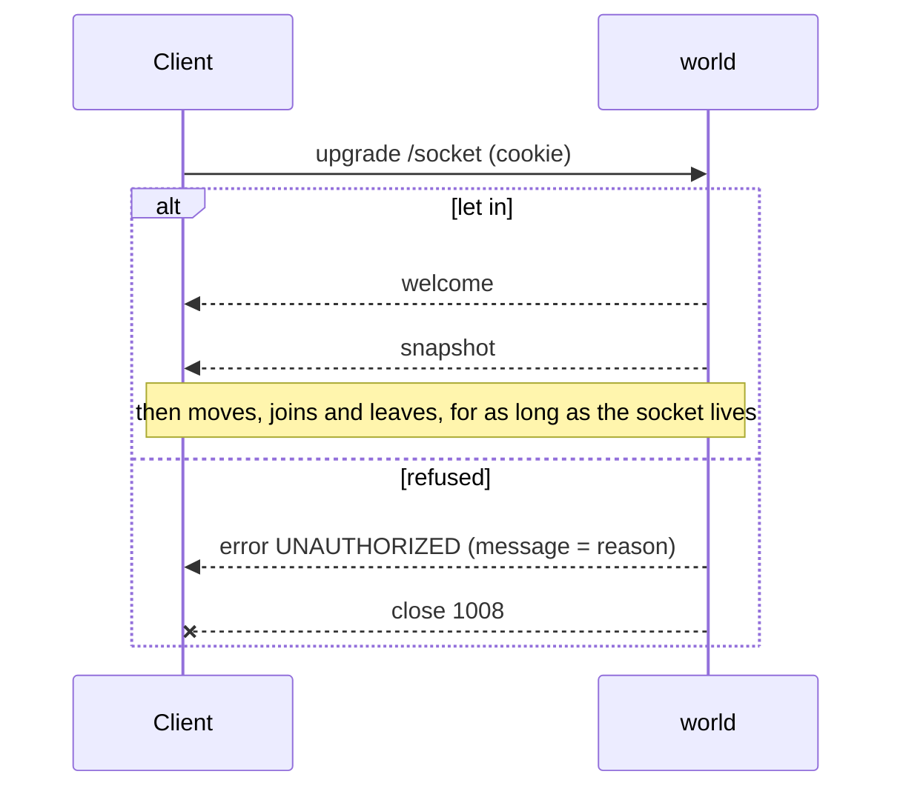

# World protocol

How a client talks to `world`, the realtime service: connecting, moving,
drawing everybody else, and what to do when the socket closes.

The message shapes are not in this document. They live in
[`apps/world/protocol.schema.json`](../apps/world/protocol.schema.json),
generated from the server's code, with a description on every message and
field. Generate your types from it rather than writing them by hand:

```sh
npx json-schema-to-typescript -i apps/world/protocol.schema.json -o world-protocol.d.ts
```

That gives `ClientMessage`, `ServerMessage`, one type per message
(`MoveMessage`, `MovedMessage`, `MoveResultMessage`, …), and `Player`,
`Direction` and `MoveOutcome`. This document covers what the schema cannot:
the order things happen in, and what the client is expected to do about them.

## Connecting

Open a WebSocket to `/socket` on the world service. Every frame, both ways, is
one JSON object with a `type`.

- **Authentication is the session cookie.** The browser sends
  `campus_session` on the upgrade by itself; the page does nothing. Only a
  `full_access` session gets in — somebody still in onboarding is refused.
- **The page's origin must be in world's `CORS_ORIGINS`.** A WebSocket is not
  covered by CORS, so world checks `Origin` itself and refuses anything not on
  its list.
- **Not a browser?** Send `Authorization: Bearer <token>` and no cookie.

> **Open issue — production.** The session cookie is set by campus-api with
> no `Domain`, so browsers only send it back to campus-api's own host. Locally
> that is fine: cookies ignore ports, and both services are `localhost`. Once
> world has its own hostname it will not receive the cookie, and browsers
> cannot put an `Authorization` header on a WebSocket. Until that is solved,
> browser connections work in local development only.

### What arrives first



- **`welcome`** carries your `userId` and the timings to play by:
  `stepMs` (walking speed), `tickMs` (how often others' moves arrive) and
  `heartbeatSeconds`.
- **`snapshot`** carries the map size and every player on it, you included.
  Draw from it; everything after is a change to it.

You can send as soon as the socket opens. Frames sent while the server is
still checking the session are held, not lost, and answered in order.

## The map

Positions are **tiles**, never pixels: `x` is the column from 0 at the left,
`y` the row from 0 at the top, so `up` is `y - 1`. The tile's pixel size is
entirely the client's — multiply by it to draw. The server never sees it.

For now the map is a placeholder rectangle of `snapshot.map.width` ×
`height`, and its edge is the only thing that blocks. Real maps, with walls,
spaces and portals, replace it later.

Two people can stand on the same tile. Nobody blocks anybody.

## Moving yourself

The client says which way, never where to. The server decides every position.

1. **Move at once, then tell the server.** On a key press, draw the step
   straight away and send `{ "type": "move", "direction": "right", "seq": 12 }`.
   `seq` is your own counter; increase it by one per move.
2. **Pace to `stepMs`.** Animate each step over `welcome.stepMs`, and while a
   key is held send the next move when the previous animation ends. Faster
   than that and the server answers `too_fast`. It allows a short burst — a
   few steps delayed by the network and delivered together — but not a
   sustained run.
3. **Every move is answered with a `moveResult`**, in the order sent, carrying
   your `seq` and where the server has you:

   | `outcome` | Meaning | What to draw |
   | --- | --- | --- |
   | `moved` | One tile, as you predicted | Nothing changes |
   | `blocked` | Not walkable; you turn to face it without moving | Snap back, facing the new way |
   | `too_fast` | Over walking speed; nothing happened, not even the turn | Snap back |

4. **Correct against the server, then replay what it has not answered yet.**
   By the time a `moveResult` arrives you may have predicted further steps.
   Throwing those away would jerk the avatar backwards; keeping the prediction
   and ignoring the answer would let the two drift apart. So:

   ```ts
   // `pending`: moves sent and not yet answered, oldest first.
   function onMoveResult(result: MoveResultMessage) {
     pending = pending.filter((move) => move.seq > result.seq);
     me = result.player;
     for (const move of pending) {
       me = predictStep(me, move.direction); // your own step, edge check included
     }
   }
   ```

   When every prediction was right — nearly always — this changes nothing on
   screen.

## Everybody else

| Message | When | What to do |
| --- | --- | --- |
| `joined` | Somebody arrived | Add their avatar |
| `left` | Somebody's last tab closed | Remove their avatar |
| `moved` | Once per tick, if anybody moved or turned | Move each listed player |

About `moved`:

- **One entry per person, as they stand now.** Two steps inside one tick
  arrive as the second, so an entry can be **more than one tile** from where
  you last drew them. Walk the gap one tile at a time rather than sliding
  diagonally — a diagonal slide cuts corners that will be walls once real
  maps exist.
- **You are left out of your own entry when you made the latest change** —
  your `moveResult` already says where you ended up.
- **You are in it for your own avatar when another tab moved it after you
  did**, including when both of your tabs stepped inside the same tick. Treat
  that entry like a `moveResult`: take the position, then replay any moves of
  your own still pending.

## Two tabs

One person is one avatar however many tabs they have open. Both tabs see it
and either can walk it. A second tab does not announce an arrival, and closing
one does not remove the avatar — only closing the last does.

## Limits

- **Messages:** about `WORLD_MAX_MESSAGES_PER_SECOND` (20 by default) per
  socket, with a second's worth allowed at once. Walking at full speed while
  pinging uses about half. Past the budget, frames are **dropped unanswered**.
  A dropped `move` never gets a `moveResult`; the correction above still
  recovers, since the next answer clears every older pending move, but the
  avatar snaps back. Keep it up and the socket is closed with
  `rate_limited`.
- **Frame size:** 16 KB by default. Larger closes the socket with 1009.
- **Reading:** a client that stops reading what it is sent — a frozen tab, a
  debugger paused on a breakpoint — is disconnected once about 1 MB is waiting
  for it, rather than skipped: skipped frames would leave it believing people
  stand where they no longer do. It sees a 1006 and reconnects to a fresh
  snapshot.

## Staying connected

The server pings every `heartbeatSeconds` and drops a socket that has not
answered by the next ping. Browsers answer these pings themselves; there is
nothing to write. The `ping` message exists for clients that want to measure
round-trip time, and gets a `pong`.

## Errors and closing

An `error` with code `BAD_MESSAGE` means the frame was not valid JSON or not a
message the server knows. The socket stays open. Seeing one means a client
bug, so log it.

When the socket closes:

| Code | Reason | Meaning | What to do |
| --- | --- | --- | --- |
| 1008 | `no_token`, `token_not_usable`, `session_expired` | No usable session | Send them to sign in |
| 1008 | `wrong_scope` | Still in onboarding | Send them to onboarding |
| 1008 | `account_suspended`, `account_gone` | Not welcome any more | Sign them out; do not reconnect |
| 1008 | `origin_not_allowed` | This page's origin is not on world's list | Configuration — do not retry |
| 1008 | `rate_limited` | Sustained sending over the message budget | Client bug; reconnect with backoff |
| 1001 | `server shutting down` | A deploy or restart | Reconnect |
| 1009 | — | A frame over the size limit (16 KB by default) | Client bug; reconnect |
| 1011 | `internal_error` | The server could not check the session | Reconnect with backoff |
| 1006 | — | Connection lost, a missed heartbeat, or not reading fast enough | Reconnect with backoff |

When the connection is refused at the start, an `error` frame with the same
reason as its `message` arrives just before the close. A socket closed later
— `session_expired`, or a suspension that reaches an open socket — gets the
close alone, so read the reason from the close event, not from an `error`.

**A reconnect starts from spawn.** Positions are not kept for a dropped
socket yet, and a server restart forgets everybody's. Treat every
`snapshot` as a fresh start.

## Changing the protocol

For whoever edits the server:

1. Change the schemas in `apps/world/src/socket/protocol.ts`, with a
   description on anything new.
2. Run `pnpm --filter world protocol:schema` and commit the regenerated
   `protocol.schema.json`. CI fails if you forget.
3. Update this document if what a client should *do* changed.
4. Tell the frontend: they regenerate their types from the new file.
